# Architectuurdiagrammen

## Digitaal Keurings- en Documentbeheer

**Versie:** 1.2 Concept  
**Status:** Architectuurvoorstel

## 1. Doel van dit document

Dit document visualiseert de samenhang tussen frontend, backend, database, opslag, AI-platform, documentverwerking, naamgeving, migratie, sterke authenticatie, monitoring en herstel.

De diagrammen zijn opgesteld in Mermaid-formaat en gelden samen met de andere ontwerpdocumenten als richtinggevend architectuurcontract.

## 2. Systeemcontext

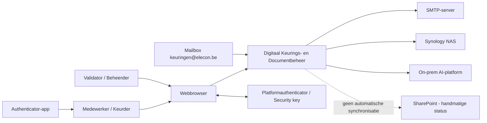

Belangrijkste regels:

- Gebruikers werken via HTTPS.
- Sterke authenticatie ondersteunt TOTP en WebAuthn/Passkeys.
- Biometrische verificatie gebeurt lokaal op het apparaat; de applicatie bewaart geen biometrische gegevens.
- PostgreSQL is de bron van waarheid voor metadata, relaties, credentials en audit.
- Documentbestanden staan op de Synology NAS.
- AI-verwerking gebeurt op het gedeelde on-prem AI-platform.

## 3. Containerarchitectuur

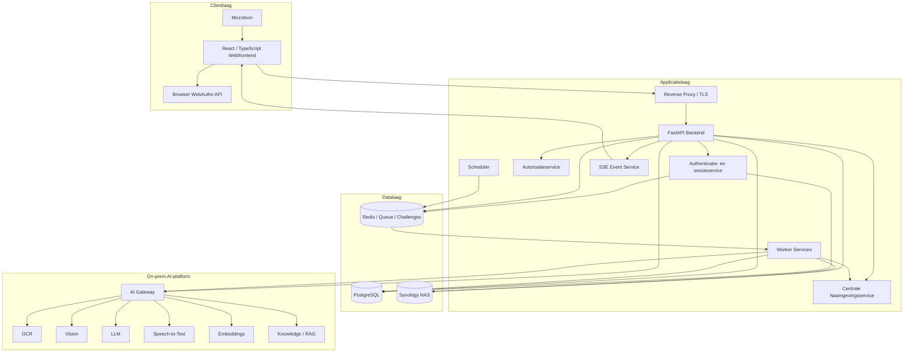

## 4. Deploymentarchitectuur

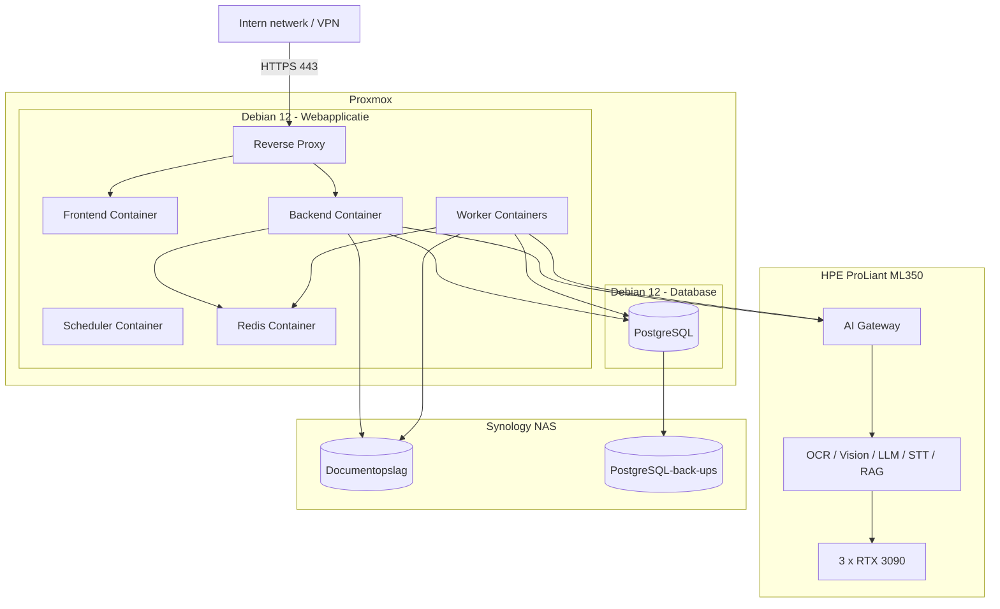

## 5. Documentupload en verwerking

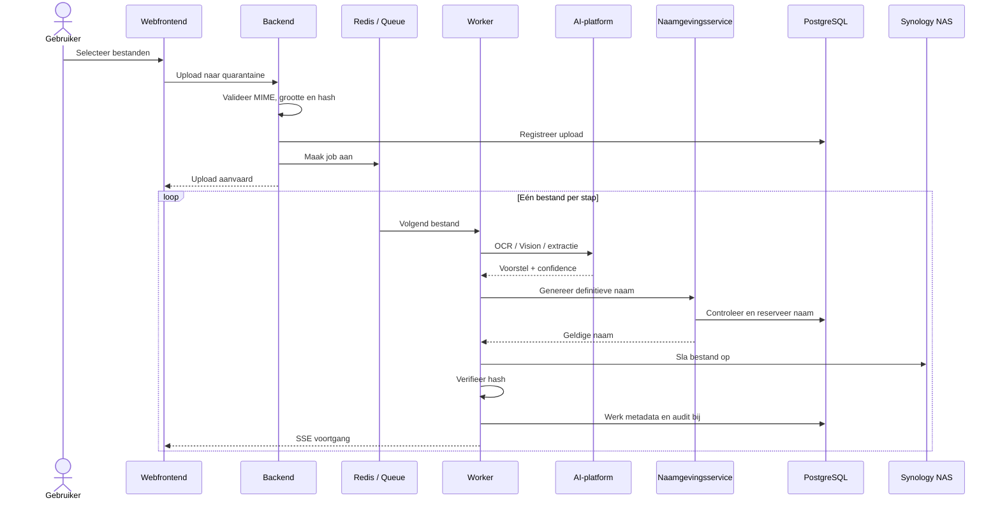

De definitieve naamgeneratie en bestandsmutatie gebeuren altijd sequentieel.

## 6. Centrale bestandsnaamgeneratie

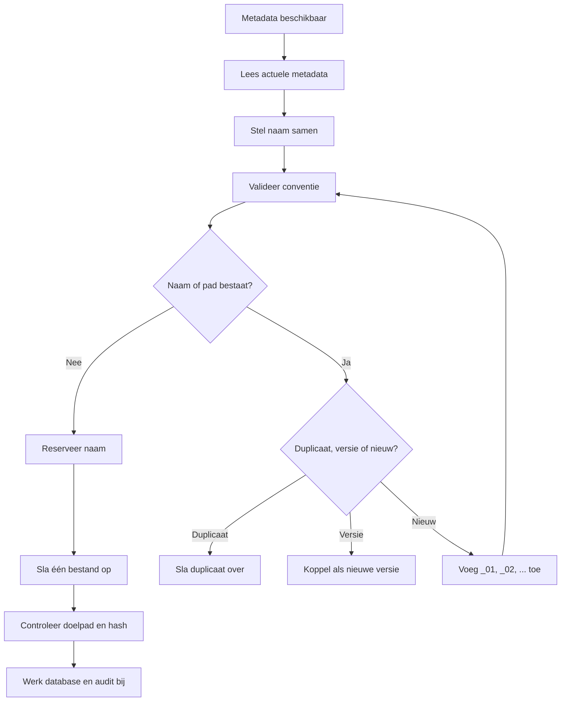

## 7. Onveranderlijke fysieke opslag

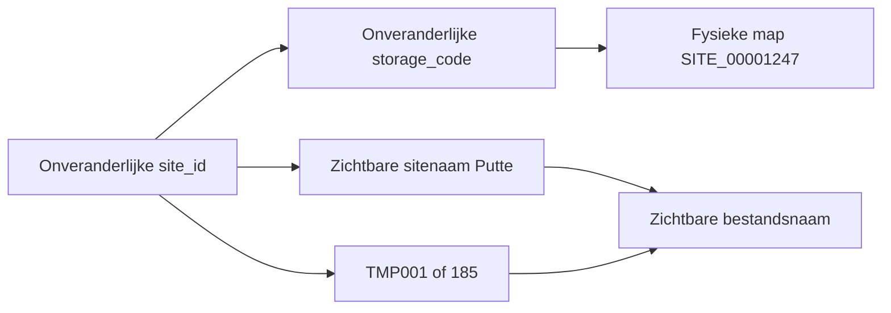

De fysieke hoofdmap wordt nooit hernoemd wanneer de zichtbare sitenaam of het sitenummer wijzigt.

## 8. Tijdelijke Site naar definitieve Site

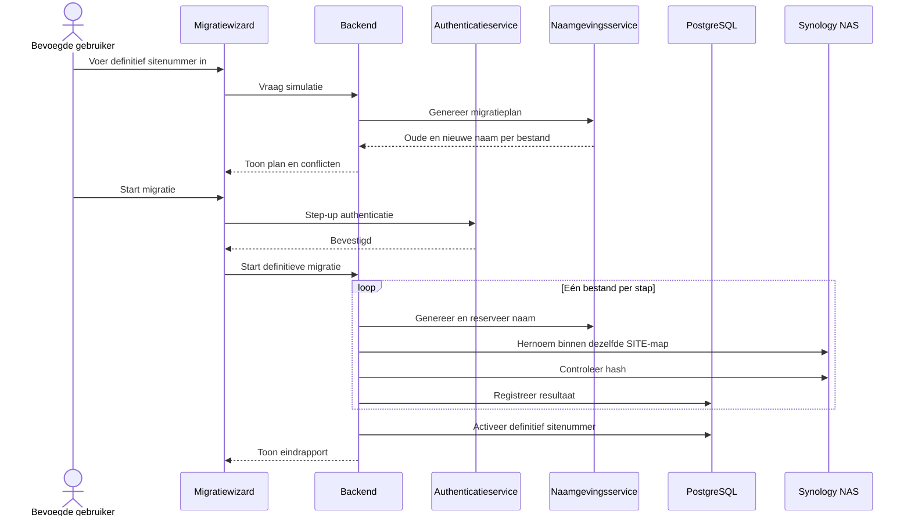

## 9. AI-validatie en feedback

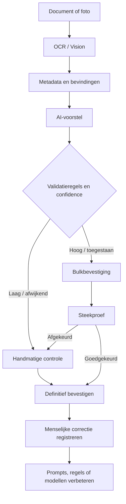

## 10. RAG- en kennisarchitectuur

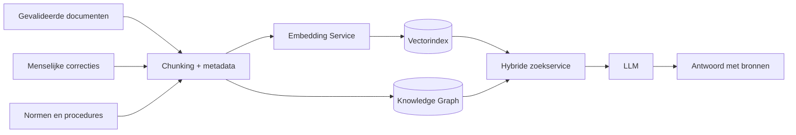

## 11. Gecombineerde authenticatiestroom

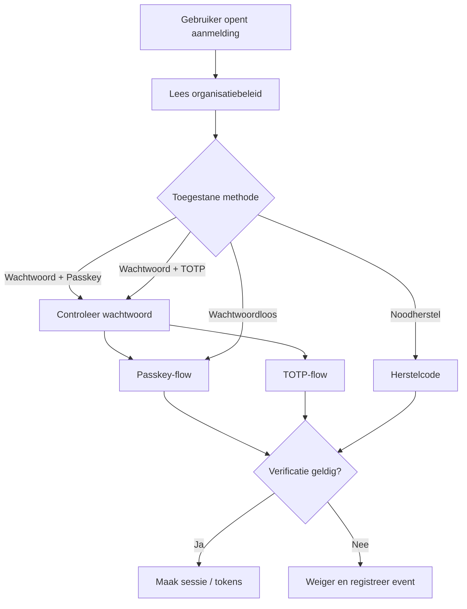

## 12. WebAuthn / Passkey-registratie

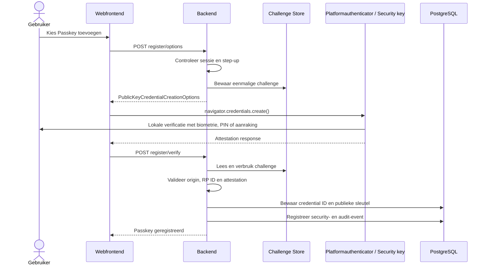

De private sleutel en biometrische gegevens blijven op de authenticator.

## 13. Passkey-login

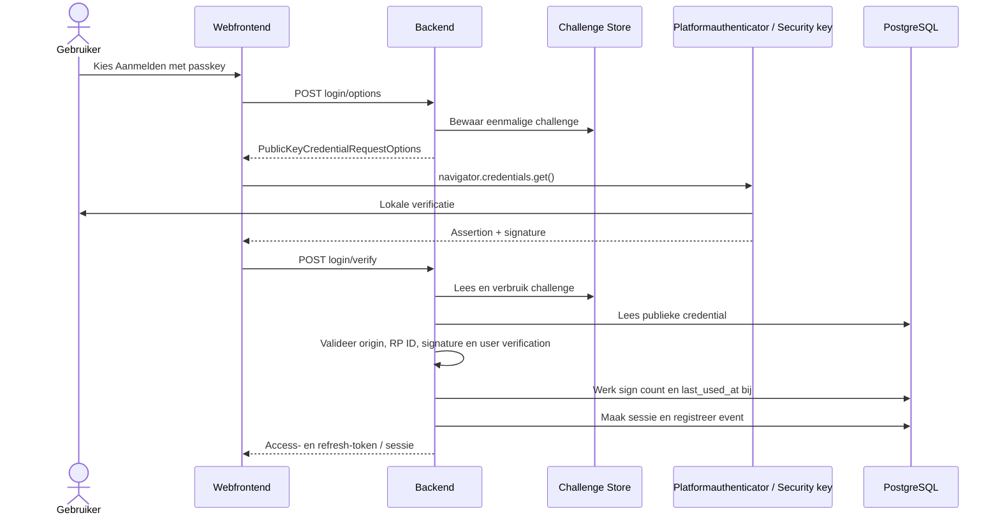

## 14. TOTP-login

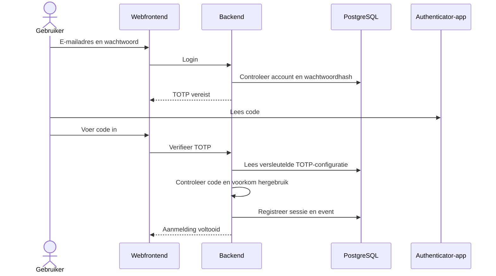

## 15. Step-up authenticatie

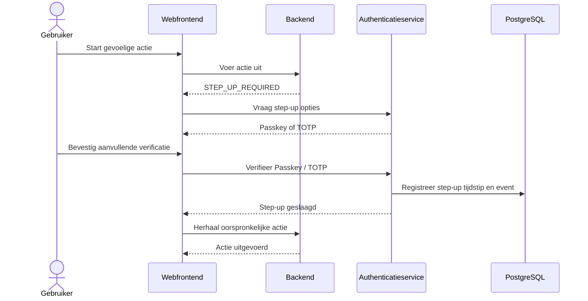

## 16. Multi-device- en credentialbeheer

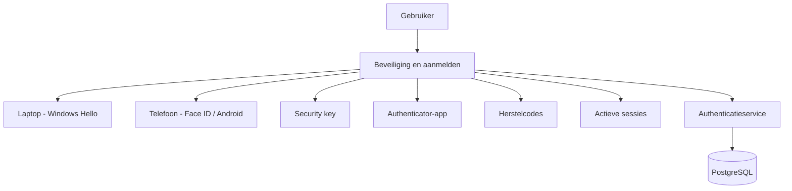

Beheerregels:

- Een gebruiker kan meerdere Passkeys registreren.
- Passkeys kunnen worden hernoemd en ingetrokken.
- Het verwijderen van de laatste bruikbare sterke authenticatiemethode wordt geblokkeerd.
- Credentialwijzigingen vereisen step-up authenticatie.
- Beveiligingswijzigingen kunnen bestaande sessies intrekken.

## 17. Autorisatiestroom

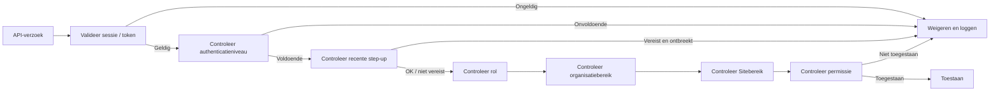

## 18. Monitoring en security-events

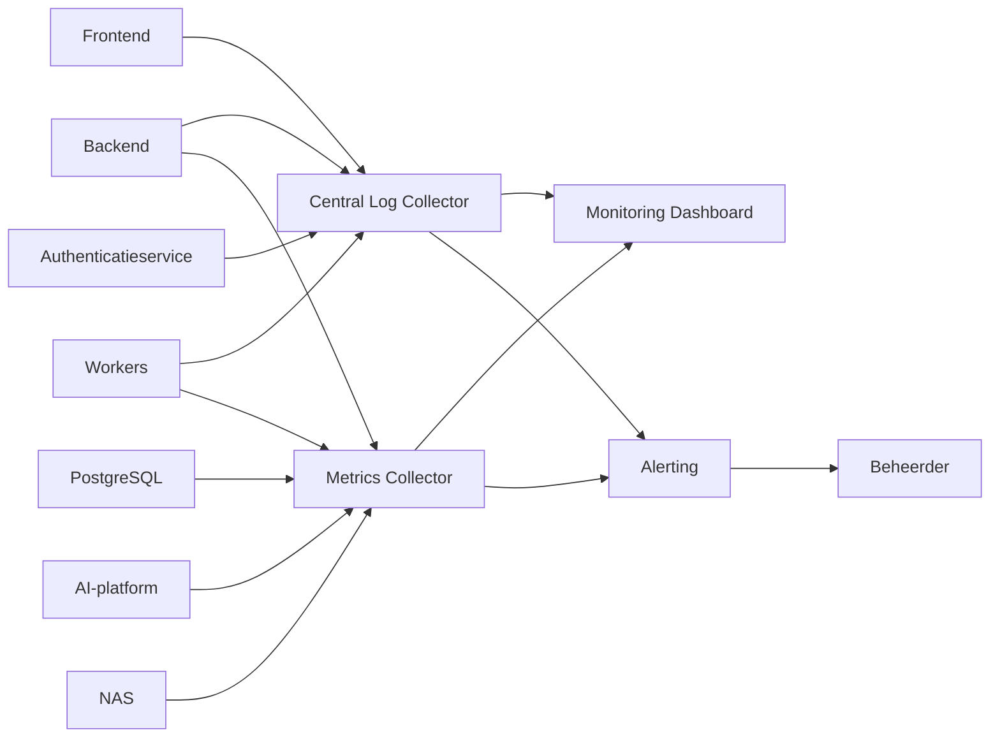

Te bewaken indicatoren:

- API-fouten en responstijd;
- actieve en falende jobs;
- AI-wachttijd en GPU-gebruik;
- PostgreSQL- en NAS-status;
- mislukte logins, TOTP-fouten en WebAuthn-fouten;
- verdachte credential- of sessiewijzigingen;
- openstaande validaties en migraties.

## 19. Back-up en herstel

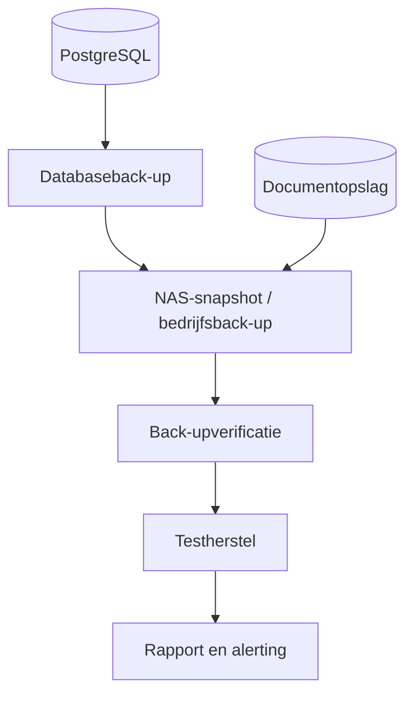

Encryptiesleutels voor TOTP-geheimen worden niet samen met de databaseback-up opgeslagen.

## 20. Release en rollback

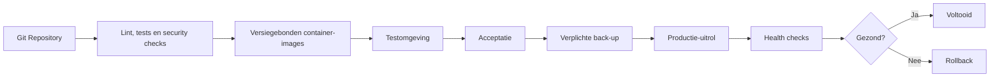

## 21. Bevestigde architectuurbeslissingen

- React/TypeScript frontend met FastAPI backend.
- PostgreSQL als centrale bron van waarheid.
- Redis voor queues, locks en tijdelijke WebAuthn-challenges.
- Synology NAS als fysieke documentopslag.
- Centrale Naamgevingsservice en verplichte sequentiële bestandsverwerking.
- Onveranderlijke fysieke `storage_code` per Site.
- On-prem AI-platform op de HPE ML350 met 3 x RTX 3090.
- Sterke authenticatie via TOTP en WebAuthn/Passkeys.
- Passkeys zijn de aanbevolen authenticatiemethode.
- Wachtwoordloze en usernameless login zijn configureerbaar.
- Biometrische gegevens worden niet door de applicatie opgeslagen.
- Step-up authenticatie beschermt gevoelige acties.
- Meerdere Passkeys en actieve sessies zijn per gebruiker beheersbaar.
- Herstelcodes worden eenmalig gebruikt en gehasht opgeslagen.
- Geen automatische SharePoint-integratie.

## 22. Openstaande technische keuzes

- Definitieve RP ID en toegestane origins per omgeving.
- Attestationbeleid en eventuele AAGUID-allowlist.
- JWT in headers of beveiligde sessiecookies.
- Exacte geldigheidsduur van challenges, sessies en step-up bevestigingen.
- Celery of RQ.
- NFS of SMB voor NAS-toegang.
- Definitieve monitoringstack.
- Strategie voor hoge beschikbaarheid.

## 23. Relatie met andere ontwerpdocumenten

| Document | Relatie |
|---|---|
| `01_Functioneel_Ontwerp.md` | Functionele eisen en processen |
| `02_Technisch_Ontwerp.md` | Technische architectuur en beveiliging |
| `03_Database_Ontwerp.md` | Tabellen, credentials, sessies en constraints |
| `04_AI_Knowledge_Platform_Ontwerp.md` | AI-, RAG- en kennisarchitectuur |
| `05_API_Ontwerp.md` | REST-, WebAuthn- en step-up-endpoints |
| `06_Deployment_Infrastructuur.md` | Infrastructuur, netwerk en back-up |
| `07_UI_UX_Ontwerp.md` | Aanmeldschermen en credentialbeheer |
| `08_Architectuur_Diagrammen.md` | Visuele samenhang van alle onderdelen |
