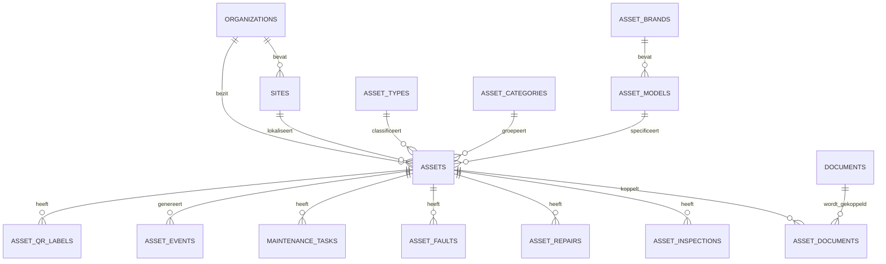

# Databaseontwerp Toestellenmodule

## Digitaal Keurings- en Documentbeheer

**Documentnummer:** 10  
**Versie:** 1.0 Concept  
**Gerelateerd:** `03_Database_Ontwerp.md`, `09_Toestellen_En_Onderhoudsbeheer.md`

## 1. Doel

Dit document specificeert het relationele datamodel voor toestellen, QR-labels, onderhoud, storingen, herstellingen, keuringen, documenten en statistische aggregaties.

## 2. Ontwerpprincipes

- Multi-tenant: elke bedrijfsentiteit is aan een organisatie gekoppeld.
- Sitescoping wordt backendmatig afgedwongen.
- Toestellen worden logisch gearchiveerd, niet fysiek verwijderd.
- Historische gebeurtenissen zijn append-only.
- Documentinhoud wordt hergebruikt uit de bestaande documentmodule.
- QR-tokens worden gehasht opgeslagen.
- Geldbedragen gebruiken `numeric(14,2)` en een ISO-valutacode.
- Tijden worden als `timestamptz` opgeslagen.
- Technische uitbreidingen gebruiken alleen waar nodig `jsonb`.

## 3. Kernrelaties



## 4. Enumeraties

Aanbevolen PostgreSQL-enums of gecontroleerde referentietabellen:

- `asset_status`: `draft`, `active`, `maintenance_due`, `faulty`, `limited`, `under_repair`, `out_of_service`, `rejected`, `disposed`, `archived`.
- `asset_criticality`: `low`, `medium`, `high`, `critical`.
- `maintenance_status`: `planned`, `assigned`, `started`, `completed`, `partially_completed`, `rejected`, `cancelled`, `not_executable`, `confirmed`.
- `fault_status`: `open`, `triaged`, `assigned`, `in_progress`, `resolved`, `closed`, `cancelled`.
- `inspection_result`: `approved`, `approved_with_remarks`, `rejected`, `not_completed`.
- `qr_label_status`: `active`, `revoked`, `replaced`, `expired`.

Referentietabellen genieten de voorkeur wanneer organisaties extra waarden mogen configureren.

## 5. Stamtabellen

### 5.1 `asset_brands`

```sql
create table asset_brands (
    id uuid primary key,
    organization_id uuid null references organizations(id),
    name varchar(160) not null,
    normalized_name varchar(160) not null,
    manufacturer_name varchar(160),
    is_active boolean not null default true,
    created_at timestamptz not null default now(),
    updated_at timestamptz not null default now(),
    unique nulls not distinct (organization_id, normalized_name)
);
```

### 5.2 `asset_types`

Velden: `id`, `organization_id`, `code`, `name`, `description`, `parent_type_id`, `is_active`, auditvelden.

Constraint: `unique nulls not distinct (organization_id, code)`.

### 5.3 `asset_categories`

Ondersteunt hiërarchie via `parent_category_id`. Cycli worden applicatief en via constraint-trigger voorkomen.

### 5.4 `asset_models`

Bevat merk, type, modelnaam, modelcode, standaardonderhoudsinterval, verwachte levensduur en technische standaardeigenschappen.

## 6. Toestellen

### 6.1 `assets`

```sql
create table assets (
    id uuid primary key,
    asset_code varchar(32) not null unique,
    organization_id uuid not null references organizations(id),
    site_id uuid references sites(id),
    building_id uuid null,
    floor_id uuid null,
    room_id uuid null,
    asset_type_id uuid not null references asset_types(id),
    asset_category_id uuid references asset_categories(id),
    brand_id uuid references asset_brands(id),
    model_id uuid references asset_models(id),
    display_name varchar(240) not null,
    serial_number varchar(180),
    inventory_number varchar(120),
    status varchar(40) not null,
    criticality varchar(20) not null default 'medium',
    commissioned_at date,
    purchase_date date,
    warranty_until date,
    purchase_cost numeric(14,2),
    currency char(3),
    supplier_id uuid null,
    responsible_user_id uuid null,
    responsible_team_id uuid null,
    technical_properties jsonb not null default '{}'::jsonb,
    notes text,
    main_document_id uuid null references documents(id),
    created_by uuid not null references users(id),
    created_at timestamptz not null default now(),
    updated_at timestamptz not null default now(),
    archived_at timestamptz,
    check (purchase_cost is null or purchase_cost >= 0)
);
```

Aanvullende regels:

- `asset_code` wordt uitsluitend door de Naming Service toegekend.
- Site en organisatie moeten overeenkomen.
- Serienummer kan organisatiespecifiek uniek worden gemaakt.
- `archived_at` vereist status `archived`.

## 7. Locatiehistorie

`asset_location_history` bevat geldigheidsintervallen. Per toestel mag maximaal één record `valid_until is null` hebben.

Aanbevolen exclusion constraint voorkomt overlappende intervallen met `tstzrange`.

## 8. QR-labels

```sql
create table asset_qr_labels (
    id uuid primary key,
    asset_id uuid not null references assets(id),
    token_hash bytea not null unique,
    token_prefix varchar(12) not null,
    label_type varchar(40) not null default 'primary',
    status varchar(20) not null default 'active',
    created_at timestamptz not null default now(),
    created_by uuid not null references users(id),
    printed_at timestamptz,
    last_scanned_at timestamptz,
    scan_count bigint not null default 0,
    revoked_at timestamptz,
    revoked_by uuid references users(id),
    revocation_reason text
);
```

De ruwe token wordt slechts éénmaal getoond tijdens generatie en daarna niet bewaard.

## 9. Gebeurtenissen

`asset_events` is append-only en vormt de tijdlijn.

Belangrijke velden: `asset_id`, `organization_id`, `event_type`, `event_time`, `title`, `description`, `actor_user_id`, `related_entity_type`, `related_entity_id`, `metadata`.

Updates en deletes zijn alleen toegestaan voor technische beheertaken onder strikte audit.

## 10. Onderhoud

### 10.1 `maintenance_plans`

Een plan kan gelden voor één toestel, model of toesteltype. Precedentie:

1. toestelspecifiek;
2. modelspecifiek;
3. typespecifiek.

### 10.2 `maintenance_tasks`

Bevat planning, uitvoering, bevestiging, kosten, checklistresultaat en volgende vervaldatum.

### 10.3 `maintenance_task_measurements`

Voor meetwaarden:

- `task_id`;
- `measurement_code`;
- `numeric_value`;
- `text_value`;
- `unit`;
- `lower_limit`;
- `upper_limit`;
- `is_within_limits`.

### 10.4 `maintenance_task_documents`

Koppelt foto's, werkbonnen en rapporten aan een onderhoudstaak zonder documentinhoud te dupliceren.

## 11. Storingen en herstellingen

### 11.1 `asset_faults`

Legt melding, impact, prioriteit, veiligheidsrisico, stilstand, status en foutcode vast.

### 11.2 `asset_repairs`

Legt diagnose, hoofdoorzaak, werk, kosten, testresultaat en eindstatus vast.

### 11.3 `repair_fault_links`

Ondersteunt many-to-many tussen herstellingen en storingen.

### 11.4 `repair_parts`

Bevat onderdelen, aantallen, artikelcodes en kosten.

## 12. Keuringen

- `asset_inspection_plans`: interval, waarschuwingen, verplichting en scope.
- `asset_inspections`: datum, resultaat, vervaldatum, bevindingen en attest.
- `inspection_findings`: individuele tekortkomingen, ernst, status en hersteltermijn.
- `inspection_corrective_actions`: corrigerende acties en opvolging.

## 13. Documentkoppelingen

`asset_documents` koppelt bestaande documenten aan een toestel met categorie, geldigheid en hoofdstatus.

Unieke constraint voorkomt dezelfde documentkoppeling dubbel:

```sql
unique (asset_id, document_id, document_category)
```

## 14. Autorisatieondersteuning

Alle transactietabellen bevatten of herleiden `organization_id`. Voor performante tenantfilters kan `organization_id` bewust worden gedenormaliseerd naar storingen, taken, herstellingen en keuringen.

Row-Level Security kan aanvullend worden ingezet, maar vervangt geen applicatieve autorisatie.

## 15. Indexen

```sql
create index ix_assets_org_site_status on assets(organization_id, site_id, status);
create index ix_assets_type_model on assets(asset_type_id, model_id);
create index ix_assets_serial on assets(organization_id, serial_number) where serial_number is not null;
create index ix_asset_events_timeline on asset_events(asset_id, event_time desc);
create index ix_faults_asset_date on asset_faults(asset_id, reported_at desc);
create index ix_faults_open on asset_faults(organization_id, status, priority) where status not in ('closed','cancelled');
create index ix_maintenance_due on maintenance_tasks(organization_id, due_at) where status not in ('completed','confirmed','cancelled');
create index ix_inspections_expiry on asset_inspections(organization_id, expires_at);
```

## 16. Aggregaties

Aanbevolen materialized views:

- `mv_asset_monthly_faults`;
- `mv_asset_monthly_costs`;
- `mv_asset_monthly_downtime`;
- `mv_site_maintenance_compliance`;
- `mv_site_inspection_compliance`;
- `mv_asset_reliability_metrics`.

Refresh gebeurt incrementeel via workers waar mogelijk en volledig tijdens onderhoudsvensters.

## 17. Retentie en archivering

- Toestellen: bewaren zolang organisatiebeleid vereist.
- Onderhoud, storingen, herstellingen en keuringen: niet verwijderen via normale UI.
- QR-scanlog: geaggregeerd bewaren; individuele IP- of user-agentgegevens alleen volgens privacybeleid.
- Documenten: bestaande documentretentie blijft leidend.

## 18. Migraties

Alembic-migraties moeten:

- vooruit en waar mogelijk achteruit kunnen;
- constraints pas na datamigratie activeren;
- grote indexen `concurrently` opbouwen;
- backfilltaken hervatbaar maken;
- migratiestatus auditen.

## 19. Testgevallen

- Organisatiescheiding op elke tabel.
- Onveranderlijk `asset_code`.
- Geen overlappende actieve locaties.
- Intrekken en vervangen van QR-labels.
- Kosten mogen niet negatief zijn.
- Vervaldatum keuring na keuringsdatum.
- Historie blijft intact na archivering.
- Rapportaggregaties zijn reproduceerbaar vanuit transactiedata.
