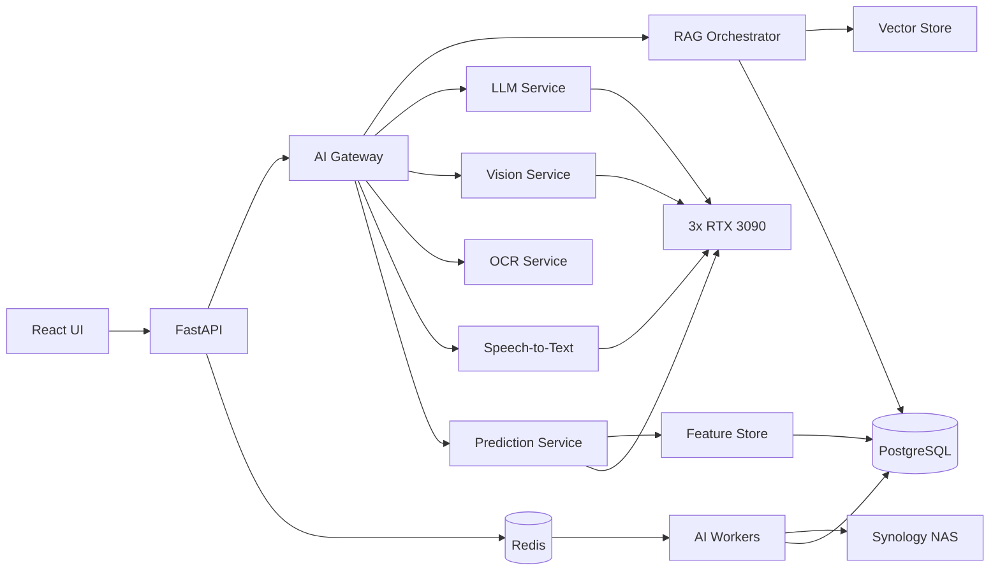
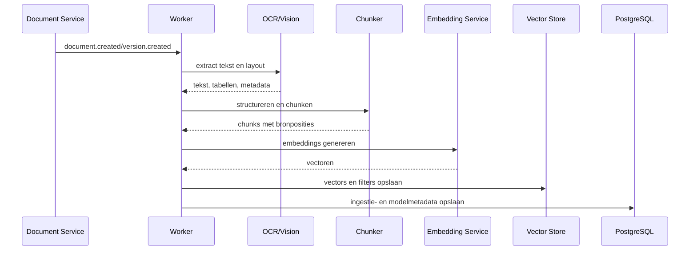

# AI Asset Analytics

## Digitaal Keurings- en Documentbeheer

**Documentnummer:** 13  
**Versie:** 1.0 Concept  
**Gerelateerd:** `04_AI_Knowledge_Platform_Ontwerp.md`, `09_Toestellen_En_Onderhoudsbeheer.md`, `10_Database_Ontwerp_Toestellen.md`, `11_API_Ontwerp_Toestellen.md`, `12_UI_UX_Toestellen.md`

## 1. Doel

Dit document beschrijft de AI-laag voor toestellen-, onderhouds-, storings-, herstellings- en keuringsbeheer. De oplossing ondersteunt gebruikers bij zoeken, analyseren, samenvatten, classificeren, voorspellen en prioriteren, zonder autonome beslissingen te nemen die veiligheid, compliance of beschikbaarheid beïnvloeden.

De AI-functionaliteit bouwt voort op het bestaande on-premises AI Knowledge Platform met:

- HPE ML350;
- 346 GiB RAM;
- 3× RTX 3090;
- AI Gateway;
- OCR;
- Vision;
- LLM;
- Speech-to-Text;
- embeddings;
- vector search;
- RAG;
- workers en Redis.

## 2. Uitgangspunten

- AI is adviserend, niet beslissend.
- Veiligheidskritieke acties vereisen menselijke bevestiging.
- Elke AI-uitkomst bevat herkomst, modelversie en vertrouwensniveau.
- Toegangsrechten uit de brondata blijven leidend.
- RAG mag alleen bronnen ophalen waarvoor de gebruiker bevoegd is.
- Geen tenantdata wordt zonder expliciete toestemming extern verwerkt.
- Productie-inferentie gebeurt standaard on-premises.
- Modellen worden versieerbaar, reproduceerbaar en terugrolbaar beheerd.
- Voorspellingen worden niet gepresenteerd als feiten.
- AI-uitkomsten worden niet gebruikt om auditlogs te herschrijven.

## 3. Functionele domeinen

De AI-laag omvat zes hoofddomeinen:

1. Kennisassistent en semantisch zoeken.
2. Document-, foto- en spraakverwerking.
3. Storings- en onderhoudsanalyse.
4. Predictive maintenance en anomaliedetectie.
5. Rapportering, trends en vervangingsadvies.
6. Governance, evaluatie en modelbeheer.

## 4. Architectuuroverzicht



## 5. AI Gateway

De AI Gateway vormt het enige toegestane toegangspunt naar AI-diensten.

Verantwoordelijkheden:

- authenticatie van interne services;
- autorisatiecontext doorgeven;
- modelroutering;
- prompttemplates toepassen;
- token- en contextlimieten bewaken;
- veiligheidsfilters;
- PII- en geheimdetectie;
- rate limiting;
- tracing en correlation IDs;
- modelversies registreren;
- fallbackstrategie;
- kosten- en capaciteitsmeting;
- logging zonder ongecontroleerde promptinhoud.

Aanbevolen interne routes:

```text
POST /ai/v1/chat
POST /ai/v1/rag/query
POST /ai/v1/embed
POST /ai/v1/vision/analyze
POST /ai/v1/ocr/extract
POST /ai/v1/speech/transcribe
POST /ai/v1/predict/failure-risk
POST /ai/v1/predict/rul
POST /ai/v1/anomaly/detect
POST /ai/v1/report/explain
```

## 6. Kennisassistent

### 6.1 Doel

De kennisassistent beantwoordt contextgebonden vragen over een toestel, site of organisatie, op basis van toegankelijke broninformatie.

Voorbeelden:

- Welke onderhoudsstappen schrijft de fabrikant voor?
- Welke storingen kwamen de afgelopen vijf jaar voor?
- Is dezelfde fout eerder hersteld?
- Welke onderdelen werden eerder vervangen?
- Wanneer vervalt de volgende keuring?
- Welke veiligheidsinstructies gelden voor dit model?
- Welke documenten onderbouwen dit antwoord?

### 6.2 Contextlagen

De assistent kan context ontvangen uit:

- toestelrecord;
- merk en model;
- locatie;
- onderhoudshistorie;
- storingshistorie;
- herstellingen;
- keuringen;
- handleidingen;
- technische plannen;
- foto's;
- werkbonnen;
- organisatieprocedures;
- toegestane vergelijkbare toestellen.

### 6.3 Antwoordstructuur

Elk antwoord bevat waar relevant:

```json
{
  "answer": "...",
  "confidence": 0.82,
  "sources": [
    {
      "document_id": "doc_123",
      "title": "Service Manual Model X",
      "page": 42,
      "chunk_id": "chunk_987"
    }
  ],
  "assumptions": [],
  "warnings": [],
  "model": "local-llm-version",
  "generated_at": "2026-07-31T06:00:00Z"
}
```

De UI toont bronverwijzingen naast de relevante beweringen.

## 7. RAG-architectuur

### 7.1 Ingestieflow



### 7.2 Chunking

Chunking houdt rekening met:

- hoofdstukken;
- paragrafen;
- tabellen;
- waarschuwingen;
- stappenplannen;
- figuuronderschriften;
- paginanummers;
- documentversie;
- toestelmodel;
- taal;
- organisatie- en sitescope.

Chunks uit procedures en veiligheidsinstructies mogen niet willekeurig midden in een stap worden gesplitst.

### 7.3 Metadatafilters

Elke vector bevat minimaal:

- `organization_id`;
- `site_id` indien van toepassing;
- `document_id`;
- `document_version_id`;
- `asset_id` indien toestelspecifiek;
- `asset_type_id`;
- `brand_id`;
- `model_id`;
- `document_category`;
- `language`;
- `valid_from`;
- `valid_until`;
- `security_classification`;
- `source_page`;
- `chunk_hash`.

### 7.4 Retrieval

Retrieval combineert:

- dense vector search;
- keyword/BM25 search;
- metadatafilters;
- recency;
- documentautoriteit;
- geldigheid;
- toestel- en modelrelevantie;
- reranking.

Aanbevolen volgorde:

1. Autorisatiescope bepalen.
2. Query herschrijven zonder betekenisverlies.
3. Hybride retrieval.
4. Metadatafilters afdwingen.
5. Reranking.
6. Duplicaten verwijderen.
7. Context samenstellen.
8. Antwoord genereren met citaties.

## 8. Documentverwerking

### 8.1 OCR

OCR wordt gebruikt voor:

- gescande handleidingen;
- keuringsattesten;
- werkbonnen;
- typeplaatjes;
- facturen;
- technische schema's met tekst;
- handgeschreven formulieren waar kwaliteit dit toelaat.

OCR-uitvoer bevat:

- tekst;
- pagina;
- bounding boxes;
- taal;
- confidence per blok;
- documentrotatie;
- tabellen;
- herkenningswaarschuwingen.

Lage confidence wordt zichtbaar gemaakt en kan menselijke correctie vereisen.

### 8.2 Documentclassificatie

AI kan documenten voorstellen als:

- handleiding;
- onderhoudsrapport;
- keuringsattest;
- werkbon;
- factuur;
- plan;
- foto;
- certificaat;
- overige bijlage.

De classificatie is een voorstel. Definitieve classificatie gebeurt door regels of een bevoegde gebruiker.

### 8.3 Metadata-extractie

Mogelijke velden:

- fabrikant;
- model;
- serienummer;
- documentnummer;
- revisie;
- keuringsdatum;
- vervaldatum;
- leverancier;
- onderdeelnummer;
- meetwaarden;
- veiligheidswaarschuwingen.

Extracties worden als kandidaatwaarden opgeslagen met confidence en bronpositie.

## 9. Vision-analyse

### 9.1 Gebruiksscenario's

- typeplaatje uitlezen;
- serienummer voorstellen;
- zichtbare schade signaleren;
- lekkage, corrosie of slijtage als mogelijke observatie markeren;
- documentfoto rechtzetten;
- foto aan toestel of onderdeel koppelen;
- voor/na-foto's vergelijken;
- ontbrekende veiligheidslabels signaleren.

### 9.2 Veiligheidsgrens

Vision mag niet zelfstandig bepalen dat een toestel veilig, gekeurd of operationeel is. Formuleringen zijn beperkt tot waarnemingen en suggesties, bijvoorbeeld:

```text
Mogelijke corrosievorming zichtbaar links onderaan. Laat dit controleren door een bevoegde technieker.
```

### 9.3 Beeldkwaliteit

Voor analyse wordt gecontroleerd op:

- resolutie;
- scherpte;
- belichting;
- occlusie;
- perspectief;
- relevante onderwerpdekking.

Bij onvoldoende kwaliteit vraagt de UI een nieuwe foto met concrete instructie.

## 10. Speech-to-Text

Techniekers kunnen gesproken notities opnemen tijdens onderhoud of herstelling.

Flow:

1. Audio lokaal opnemen.
2. Gebruiker ziet opnamestatus.
3. Audio versleuteld uploaden.
4. STT genereert transcript.
5. Domeintermen en toestelcodes worden genormaliseerd.
6. LLM stelt een gestructureerde notitie voor.
7. Gebruiker controleert en bevestigt.
8. Audio wordt volgens retentiebeleid verwijderd of bewaard.

Gestructureerde suggestie:

```json
{
  "summary": "Filter vervangen en condensor gereinigd.",
  "actions": ["filter vervangen", "condensor reinigen"],
  "measurements": [
    {"code": "TEMP_OUT", "value": 3.9, "unit": "C"}
  ],
  "parts": [
    {"description": "Filter type F7", "quantity": 1}
  ],
  "follow_up": "Controle binnen drie maanden"
}
```

## 11. Storingsclassificatie

AI kan bij een storingsmelding voorstellen:

- storingscategorie;
- prioriteit;
- vermoedelijke impact;
- mogelijke veiligheidsrelevantie;
- duplicaat van bestaande open melding;
- relevante eerdere incidenten;
- aanbevolen eerste controles;
- geschikt team of technieker.

De classificatie gebruikt tekst, foto's, toesteltype, criticaliteit en historie.

Automatische escalatie gebeurt alleen via expliciete bedrijfsregels, niet uitsluitend op basis van modeloutput.

## 12. Herstelassistent

De herstelassistent ondersteunt een technieker met:

- relevante handleidingfragmenten;
- eerdere vergelijkbare herstellingen;
- foutcodes;
- aanbevolen diagnosevolgorde;
- benodigde gereedschappen;
- mogelijke onderdelen;
- veiligheidswaarschuwingen;
- controlepunten na herstel.

De assistent toont duidelijk onderscheid tussen:

- fabrikantvoorschrift;
- organisatieprocedure;
- historische oplossing;
- AI-suggestie.

## 13. Onderhoudsplanning

### 13.1 Regelgebaseerde basis

De primaire planning blijft gebaseerd op:

- wettelijke verplichtingen;
- fabrikantintervallen;
- contractuele termijnen;
- bedrijfsbeleid;
- bedrijfsuren of cycli;
- criticaliteit.

AI mag intervallen analyseren en wijzigingen voorstellen, maar niet stilzwijgend aanpassen.

### 13.2 AI-voorstellen

AI kan voorstellen:

- interval verkorten bij stijgende uitval;
- interval verlengen bij aantoonbaar stabiele prestaties;
- taken combineren;
- onderhoud groeperen per locatie;
- reserveonderdelen vooraf bestellen;
- extra inspectie toevoegen;
- toestel vervangen in plaats van herstellen.

Elk voorstel bevat reden, dataonderbouwing en verwachte impact.

## 14. Predictive Maintenance

### 14.1 Doelvariabelen

Mogelijke modellen:

- kans op storing binnen 7, 30 of 90 dagen;
- kans op kritieke storing;
- verwachte tijd tot volgende storing;
- verwachte onderhoudsoverschrijding;
- risico op keuringsafwijking;
- verwachte herstelduur;
- verwachte kosten.

### 14.2 Features

Voorbeelden:

- toesteltype, merk en model;
- leeftijd;
- gebruiksuren;
- cycli;
- omgeving;
- historische storingsfrequentie;
- tijd sinds laatste storing;
- tijd sinds onderhoud;
- open bevindingen;
- onderhoudscompliance;
- reparatiehistorie;
- onderdelenvervangingen;
- stilstand;
- meetwaarden;
- sitekenmerken;
- seizoensinvloeden;
- vergelijkbare toestellen.

Geen feature mag zonder toetsing persoonsgegevens of beschermde kenmerken indirect gebruiken.

### 14.3 Minimumdataset

Een voorspellend model wordt pas geactiveerd wanneer:

- voldoende positieve en negatieve voorbeelden bestaan;
- labels betrouwbaar zijn;
- tijdsvolgorde correct is;
- datadekking per toesteltype voldoende is;
- baselineprestaties worden overtroffen;
- operationele waarde aantoonbaar is.

Bij onvoldoende data wordt een regelgebaseerde risicoscore gebruikt en expliciet als zodanig benoemd.

## 15. Remaining Useful Life

RUL schat resterende gebruiksduur voor geschikte toestelcategorieën.

Voorwaarden:

- betrouwbare levensduur- of faaldata;
- voldoende homogene populatie;
- betekenisvolle gebruiksmetingen;
- duidelijke definitie van einde levensduur;
- validatie per toesteltype.

Output:

```json
{
  "asset_id": "asset_123",
  "estimated_remaining_days": 420,
  "prediction_interval": {
    "lower": 240,
    "upper": 690
  },
  "confidence": 0.64,
  "top_factors": [
    "leeftijd",
    "storingsfrequentie",
    "toegenomen herstelkosten"
  ],
  "model_version": "rul-cooling-v3"
}
```

Bij lage confidence wordt geen enkele puntschatting prominent weergegeven; de bandbreedte staat centraal.

## 16. Anomaliedetectie

Anomaliedetectie kan werken op:

- temperatuur;
- druk;
- stroomverbruik;
- vibratie;
- bedrijfsuren;
- cycli;
- storingsfrequentie;
- onderhoudsduur;
- onderdelenverbruik;
- kosten.

Typen:

- puntanomalie;
- trendbreuk;
- seizoensafwijking;
- afwijking ten opzichte van vergelijkbare toestellen;
- datakwaliteitsanomalie.

Elke anomalie bevat:

- waargenomen waarde;
- verwacht bereik;
- tijdvenster;
- vergelijkingsgroep;
- ernst;
- confidence;
- aanbevolen controle;
- status na menselijke beoordeling.

## 17. Betrouwbaarheidsanalyse

De analytische laag berekent:

- MTBF;
- MTTR;
- beschikbaarheid;
- storingen per 1.000 bedrijfsuren;
- herhaalstoringen;
- first-time-fix rate;
- onderhoudscompliance;
- keuringscompliance;
- gemiddelde kosten per toesteljaar;
- downtime per site;
- Weibull- of survivalanalyse waar passend.

Definities worden centraal beheerd zodat dashboards, exports en AI dezelfde KPI-logica gebruiken.

## 18. Vergelijkbare toestellen

Een similarity-service vindt vergelijkbare toestellen op basis van:

- type;
- categorie;
- merk;
- model;
- leeftijd;
- gebruik;
- omgeving;
- storingsprofiel;
- onderhoudspatroon;
- technische eigenschappen.

Gebruik:

- eerdere oplossingen zoeken;
- benchmarken;
- risico-inschatting;
- vervangingsplanning;
- datakwaliteitscontrole.

Vergelijking over organisaties heen is standaard verboden, tenzij geanonimiseerde benchmarking expliciet is goedgekeurd.

## 19. Vervangingsadvies

Een vervangingsmodel kan signaleren dat vervanging economisch of operationeel onderzocht moet worden.

Input:

- leeftijd;
- restlevensduur;
- cumulatieve herstelkosten;
- onderhoudskosten;
- stilstand;
- beschikbaarheid;
- energieverbruik;
- onderdelenbeschikbaarheid;
- keuringsrisico;
- veiligheidsbevindingen;
- contractuele eisen;
- aanschaf- en migratiekosten.

Output is een adviescategorie, geen automatische beslissing:

- behouden;
- intensiever opvolgen;
- vervanging budgetteren;
- vervanging versneld onderzoeken;
- buiten dienst volgens menselijke beslissing.

## 20. Kostenprognoses

AI kan prognoses maken voor:

- onderhoudskosten;
- herstelkosten;
- onderdelenbudget;
- externe keuringskosten;
- verwachte stilstandskosten;
- vervangingsbudget.

Prognoses bevatten:

- basisperiode;
- horizon;
- bandbreedte;
- aannames;
- scenario's;
- relevante trends;
- modelversie.

## 21. Automatische samenvattingen

Mogelijke samenvattingen:

- toestelgeschiedenis;
- maandelijkse sitestatus;
- storingsoverdracht;
- onderhoudsrapport;
- keuringsbevindingen;
- directierapport;
- verschillen tussen perioden;
- open risico's.

Samenvattingen mogen geen nieuwe feiten introduceren en moeten brondata linken.

## 22. Promptontwerp

### 22.1 Algemene systeeminstructie

```text
Je bent een technische assistent voor toestel- en onderhoudsbeheer.
Gebruik uitsluitend de verstrekte bronnen en gestructureerde context.
Maak duidelijk onderscheid tussen feiten, voorschriften, historische oplossingen en suggesties.
Verzin geen meetwaarden, onderdelen, normen, termijnen of veiligheidsinstructies.
Bij onvoldoende informatie meld je dit expliciet.
Veiligheidskritieke beslissingen moeten door een bevoegde persoon worden genomen.
Geef bronverwijzingen bij elke belangrijke bewering.
```

### 22.2 Storingsanalyse

```text
Analyseer de melding in relatie tot toesteltype, criticaliteit, open storingen en eerdere vergelijkbare incidenten.
Geef een voorgestelde categorie, prioriteit, eerste controles en relevante bronnen.
Presenteer vermoedelijke oorzaken als hypothesen, niet als feiten.
```

### 22.3 Onderhoudsadvies

```text
Vergelijk fabrikantvoorschriften, organisatiebeleid en onderhoudshistorie.
Vermeld conflicten tussen bronnen expliciet.
Wijzig geen onderhoudsinterval; geef alleen een onderbouwd voorstel met risico's en verwachte impact.
```

## 23. Feature Store

De feature store bevat reproduceerbare, tijdgebonden features.

Vereisten:

- point-in-time correcte joins;
- featureversies;
- datalineage;
- definities in code;
- offline trainingsset;
- online inferencefeatures;
- organisatie- en toesteltypefilters;
- kwaliteitsmetingen;
- freshness-indicator.

Voorbeelden van featuregroepen:

- `asset_static_features`;
- `asset_usage_daily`;
- `asset_fault_rolling_30d`;
- `asset_fault_rolling_365d`;
- `asset_cost_rolling_12m`;
- `asset_maintenance_compliance`;
- `asset_inspection_risk`;
- `asset_sensor_aggregates`.

## 24. Modeltraining

Trainingspipeline:

```mermaid
flowchart LR
    S[Brondata] --> Q[Datakwaliteitscontroles]
    Q --> F[Feature generatie]
    F --> SPLIT[Time-based split]
    SPLIT --> TRAIN[Training]
    TRAIN --> EVAL[Evaluatie]
    EVAL --> REG[Model Registry]
    REG --> APPROVE[Menselijke goedkeuring]
    APPROVE --> CANARY[Canary deployment]
    CANARY --> PROD[Productie]
    PROD --> MON[Monitoring]
```



Training gebruikt tijdgebaseerde splits om datalekken te voorkomen. Random splits zijn voor storingsvoorspelling meestal niet voldoende.

## 25. Model Registry

Per model worden opgeslagen:

- modelnaam;
- versie;
- doel;
- eigenaar;
- trainingscodeversie;
- datasetversie;
- featureset;
- hyperparameters;
- evaluatieresultaten;
- goedkeurder;
- risicoklasse;
- deploymentstatus;
- hardwarevereisten;
- bekende beperkingen;
- vervaldatum of reviewdatum.

## 26. Evaluatiemetrieken

### 26.1 Classificatie

- precision;
- recall;
- F1;
- PR-AUC;
- ROC-AUC;
- calibratiefout;
- false-negative rate voor kritieke storingen;
- prestaties per toesteltype en site.

### 26.2 Regressie

- MAE;
- RMSE;
- MAPE waar geschikt;
- quantile loss;
- dekking van prediction intervals.

### 26.3 RAG

- retrieval recall;
- context precision;
- citation correctness;
- answer groundedness;
- factual consistency;
- no-answer accuracy;
- autorisatielekken: vereiste waarde nul.

### 26.4 Vision/OCR

- field accuracy;
- character error rate;
- word error rate;
- documentclassificatie F1;
- confidence calibration.

## 27. Baselines

Elk AI-model wordt vergeleken met een eenvoudige baseline, bijvoorbeeld:

- vaste onderhoudsregel;
- gemiddelde per toesteltype;
- laatste waarde;
- logistieke regressie;
- beslisboom;
- keyword search zonder embeddings.

Een complex model wordt alleen ingezet wanneer het aantoonbaar betere operationele waarde levert.

## 28. Explainability

Gebruikers zien geen onverklaarde risicoscore.

Minimale uitleg:

- belangrijkste factoren;
- relevante historie;
- vergelijkingsbasis;
- confidence;
- onzekerheidsmarge;
- modelversie;
- datum van berekening;
- aanbevolen vervolgstap.

Voorbeeld:

```text
Verhoogd storingsrisico in de komende 30 dagen.
Belangrijkste factoren:
1. Drie storingen in 90 dagen.
2. Onderhoud 42 dagen achterstallig.
3. Reparatiekosten 68% hoger dan vergelijkbare toestellen.
Confidence: middelmatig.
Advies: plan technische controle; neem geen automatische buiten-dienstbeslissing.
```

## 29. Human-in-the-loop

Menselijke goedkeuring is verplicht voor:

- wijziging onderhoudsinterval;
- wijziging toestelstatus;
- buiten dienst plaatsen;
- keuringsoordeel;
- sluiten van veiligheidskritieke storing;
- definitieve documentclassificatie bij lage confidence;
- overnemen van geëxtraheerde serienummers;
- vervangingsbesluit;
- corrigerende actie met compliance-impact.

Feedbackopties:

- correct;
- gedeeltelijk correct;
- onjuist;
- onveilig;
- bron ontbreekt;
- niet relevant.

## 30. Security

### 30.1 Autorisatie

Elke AI-aanvraag bevat een ondertekende context met:

- user ID;
- organization ID;
- toegestane sites;
- rollen;
- scopes;
- security clearance;
- correlation ID.

De AI Gateway valideert deze context en de retrievallaag past filters server-side toe.

### 30.2 Prompt injection

Maatregelen:

- documenten worden als onbetrouwbare data behandeld;
- instructies uit documenten mogen systeemregels niet overschrijven;
- toolgebruik is allowlisted;
- uitvoer wordt gevalideerd tegen schema's;
- gevoelige acties zijn niet direct beschikbaar voor het model;
- citaties moeten naar werkelijk opgehaalde chunks verwijzen;
- verdachte documentinhoud wordt gemarkeerd.

### 30.3 Gegevensbescherming

- encryptie tijdens transport en opslag;
- minimale logging;
- secrets nooit in prompts;
- prompt- en antwoordretentie configureerbaar;
- geen trainingshergebruik zonder expliciete governance;
- gevoelige velden maskeren waar mogelijk;
- exporteerbare audittrail.

## 31. Privacy

De AI-laag verwerkt alleen persoonsgegevens die noodzakelijk zijn voor het doel.

Aandachtspunten:

- techniekerprestaties niet zonder beleid rangschikken;
- geen verborgen personeelsprofilering;
- spraakopnames zo kort mogelijk bewaren;
- IP- en apparaatdata beperken;
- feedbackdata pseudonimiseren waar mogelijk;
- organisatiebeleid voor bewaartermijnen respecteren.

## 32. Audit en lineage

Per AI-interactie wordt opgeslagen:

- aanvraagtype;
- gebruiker;
- organisatie;
- resourcecontext;
- model en versie;
- prompttemplateversie;
- bronchunk-ID's;
- outputhash;
- confidence;
- waarschuwingen;
- menselijke feedback;
- latency;
- gebruikte GPU/service;
- correlation ID.

Volledige gevoelige promptinhoud wordt alleen opgeslagen wanneer beleid dit toestaat.

## 33. Monitoring

### 33.1 Operationeel

- beschikbaarheid;
- queue depth;
- latency p50/p95/p99;
- GPU-gebruik;
- VRAM-gebruik;
- tokenvolume;
- OCR-doorlooptijd;
- foutpercentages;
- time-outs;
- fallbackgebruik.

### 33.2 Modelkwaliteit

- input drift;
- feature drift;
- prediction drift;
- labelvertraging;
- calibratie;
- prestaties per toesteltype;
- false negatives;
- gebruikersfeedback;
- bronloze antwoorden;
- retrieval failure rate.

### 33.3 Veiligheid

- autorisatieblokkeringspogingen;
- prompt injection-detecties;
- PII-detecties;
- onveilige adviezen;
- herhaalde mislukte QR- of AI-aanvragen;
- verdachte bulkquery's.

## 34. Fallbacks

Bij onbeschikbaarheid:

- AI-functies worden tijdelijk uitgeschakeld zonder kernprocessen te blokkeren;
- keyword search blijft beschikbaar;
- onderhoud en keuring blijven handmatig uitvoerbaar;
- opgeslagen rapporten blijven leesbaar;
- wachtrijtaken worden hervat;
- UI toont duidelijk dat AI-advies niet beschikbaar is.

Er wordt nooit een leeg of verzonnen AI-antwoord als succes teruggegeven.

## 35. Capaciteitsverdeling GPU's

Indicatieve toewijzing:

- GPU 1: primaire LLM-inferentie;
- GPU 2: embeddings, reranker en secundaire LLM;
- GPU 3: Vision, OCR, STT en batchtraining.

Dynamische scheduling is toegestaan. Productie-inferentie krijgt voorrang boven niet-kritieke batchtaken.

Resourcebeleid:

- maximale context per aanvraag;
- maximale outputlengte;
- concurrencylimiet per model;
- batchvensters voor embeddings;
- automatische modelunload bij langdurige inactiviteit;
- VRAM-headroom voor piekbelasting.

## 36. Caching

Cachebare resultaten:

- documentembeddings;
- onveranderde OCR-output;
- model- en handleidingssamenvattingen;
- veelgestelde RAG-vragen binnen dezelfde autorisatiescope;
- statische features;
- rapportuitleg voor onveranderde datasetversie.

Niet zonder meer cachebaar:

- persoonsgebonden antwoorden;
- dynamische storingsstatus;
- antwoorden met veranderde autorisatie;
- veiligheidskritieke aanbevelingen.

Cache keys bevatten dataset-, model-, prompt- en autorisatieversie.

## 37. API-contracten

### 37.1 Asset chat

```text
POST /api/v1/assets/{asset_id}/ai/chat
```

```json
{
  "question": "Welke eerdere storing lijkt hierop?",
  "conversation_id": "conv_123",
  "include_history": true
}
```

### 37.2 Storingsanalyse

```text
POST /api/v1/faults/{fault_id}/ai/analyze
```

### 37.3 Onderhoudsadvies

```text
POST /api/v1/assets/{asset_id}/ai/maintenance-review
```

### 37.4 Risico

```text
GET /api/v1/assets/{asset_id}/ai/failure-risk?horizon_days=30
```

### 37.5 RUL

```text
GET /api/v1/assets/{asset_id}/ai/rul
```

### 37.6 Fotoanalyse

```text
POST /api/v1/assets/{asset_id}/ai/analyze-photo
```

### 37.7 Feedback

```text
POST /api/v1/ai/interactions/{interaction_id}/feedback
```

## 38. UI-integratie

AI wordt in de UI herkenbaar aangeduid met:

- label `AI-voorstel`;
- confidence-indicator;
- bronverwijzingen;
- knop `Waarom dit advies?`;
- feedbackknoppen;
- waarschuwing bij lage zekerheid;
- datum en modelversie in detailweergave.

AI mag nooit dezelfde visuele status krijgen als een definitief keuringsresultaat of menselijke goedkeuring.

## 39. Dashboards

AI-gerelateerde dashboards:

- storingsrisico per site;
- toestellen met stijgend risico;
- verwachte storingen komende 30/90 dagen;
- anomalieën;
- vervangingskandidaten;
- kostenprognose;
- modelkwaliteit;
- feedbackkwaliteit;
- datadekking;
- explainability-overzicht.

## 40. Datakwaliteit

Kwaliteitscontroles:

- ontbrekende serienummers;
- ongeldige datums;
- dubbele toestellen;
- onmogelijke meetwaarden;
- negatieve kosten;
- conflicterende statussen;
- open storing na archivering;
- onderhoud voltooid vóór start;
- keuringsdatum na vervaldatum;
- ontbrekende eenheden;
- plotselinge massawijzigingen.

AI kan fouten signaleren, maar correcties worden gecontroleerd uitgevoerd.

## 41. Meertaligheid

Ondersteunde principes:

- detectie van documenttaal;
- embeddings die meerdere talen ondersteunen;
- vraag en antwoord in taal van gebruiker;
- broncitaten in oorspronkelijke taal;
- technische termen niet ongecontroleerd vertalen;
- toestelcodes en onderdeelnummers exact behouden.

## 42. Teststrategie

### 42.1 Unit tests

- featureberekening;
- promptconstructie;
- schema-validatie;
- metadatafilters;
- autorisatiecontext;
- KPI-definities.

### 42.2 Integratietests

- end-to-end RAG;
- documentingestie;
- OCR naar metadata;
- Vision naar kandidaatbevinding;
- voorspelling naar UI;
- feedback naar audit.

### 42.3 Securitytests

- cross-tenant retrieval;
- prompt injection;
- documentinstructies;
- tokenmisbruik;
- ongeautoriseerde toolcalls;
- sensitive data exfiltration.

### 42.4 Evaluatieset

Een beheerde golden set bevat:

- vragen met verwachte bronnen;
- storingsclassificaties;
- onderhoudsscenario's;
- OCR-documenten;
- typeplaatfoto's;
- veiligheidskritieke no-answer-cases;
- meertalige voorbeelden.

## 43. Acceptatiecriteria

- AI-antwoorden tonen bronnen en modelversie.
- Onbevoegde data komt nooit in retrieval of output terecht.
- Veiligheidskritieke beslissingen vereisen menselijke bevestiging.
- RAG haalt geldige en actuele documentversies op.
- Voorspellende modellen overtreffen gedocumenteerde baselines.
- Confidence en onzekerheid zijn zichtbaar.
- Fallbacks blokkeren kernprocessen niet.
- Alle modeluitkomsten zijn auditbaar.
- Modeldrift en operationele fouten worden gemonitord.
- Gebruikers kunnen feedback geven.
- AI-uitvoer kan geen toestelstatus of keuring autonoom wijzigen.

## 44. Gefaseerde implementatie

### Fase 1 — Kennis en verwerking

- OCR;
- documentclassificatie;
- metadata-extractie;
- embeddings;
- semantisch zoeken;
- RAG-chat met citaties;
- spraaknotities;
- basis Vision voor typeplaatjes.

### Fase 2 — Assistentie

- storingsclassificatie;
- vergelijkbare incidenten;
- herstelassistent;
- onderhoudssamenvatting;
- rapportuitleg;
- datakwaliteitssuggesties.

### Fase 3 — Predictive analytics

- risicoscores;
- anomaliedetectie;
- kostenprognose;
- herstelduurvoorspelling;
- betrouwbaarheidsanalyse.

### Fase 4 — Geavanceerde besluitondersteuning

- RUL voor geschikte toesteltypes;
- vervangingsadvies;
- onderhoudsintervalvoorstellen;
- scenarioanalyse;
- geanonimiseerde benchmark wanneer governance dit toestaat.

## 45. Niet-functionele eisen

- On-premises als standaard.
- Geen afhankelijkheid van één modelleverancier.
- Modelwissel via AI Gateway zonder frontendwijziging.
- Herhaalbare inference voor dezelfde model- en datasetversie waar technisch mogelijk.
- Horizontaal schaalbare workers.
- Queue-based verwerking voor zware taken.
- GPU-fouten mogen kernregistratie niet blokkeren.
- Alle API-responses volgen het algemene fout- en auditmodel.
- Retentie en privacy zijn configureerbaar per organisatiebeleid.

## 46. Besluit

De AI Asset Analytics-laag biedt praktische ondersteuning voor kennisontsluiting, documentverwerking, storingsanalyse, onderhoudsplanning en voorspellende inzichten. De architectuur houdt menselijke verantwoordelijkheid, brontraceerbaarheid, tenantisolatie en veilige fallback centraal. Hiermee kan het platform geleidelijk evolueren van digitaal register naar aantoonbaar betrouwbare besluitondersteuning zonder de operationele en complianceprocessen afhankelijk te maken van AI.
